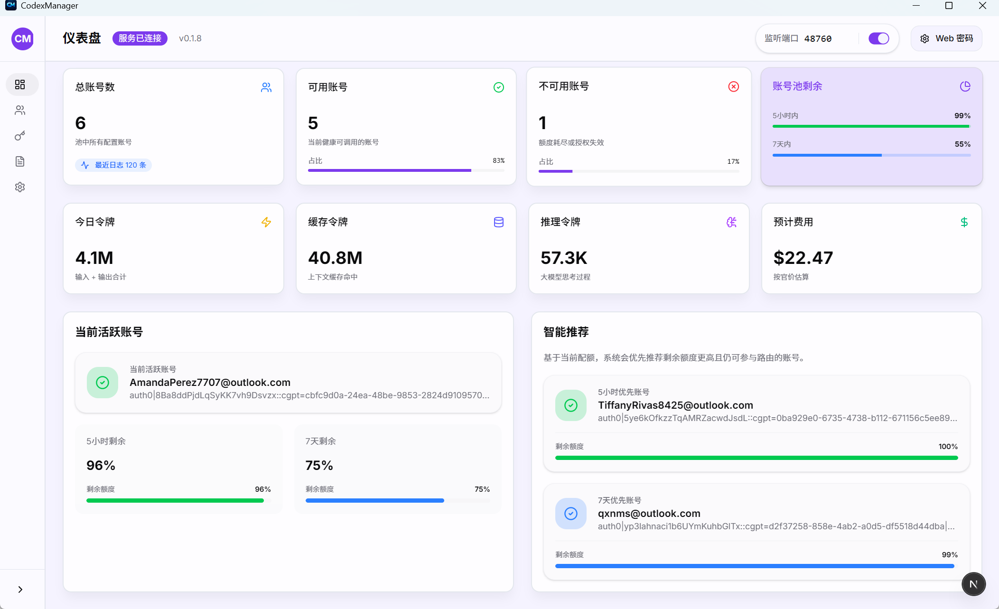
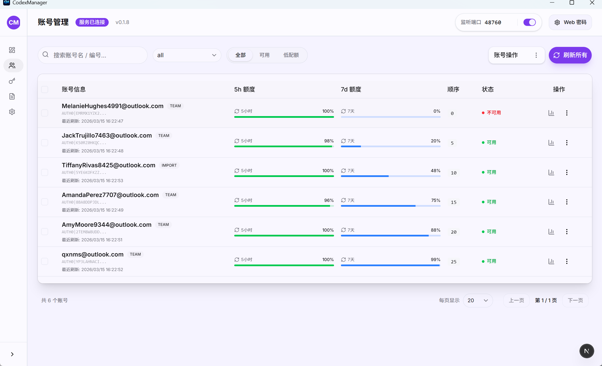
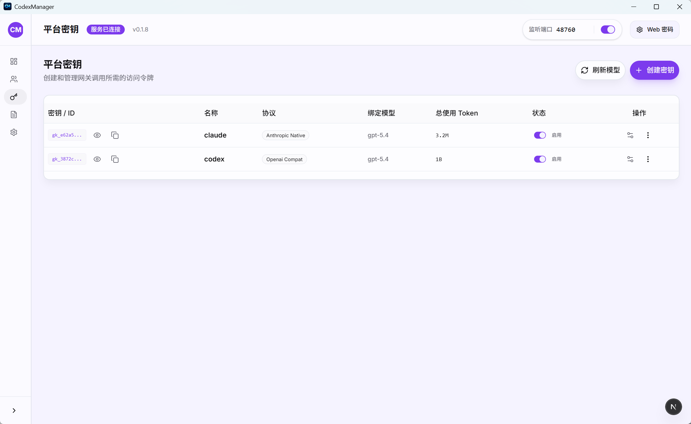
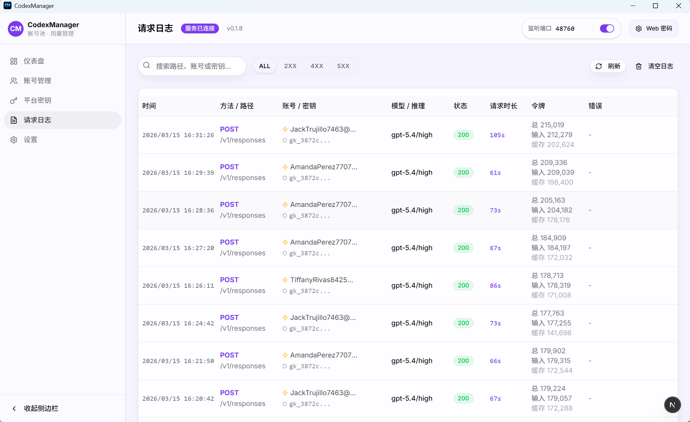
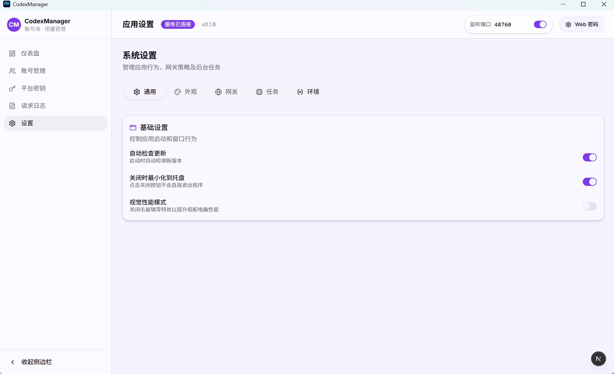

<p align="center">
  
</p>

<h1 align="center">CodexManager</h1>

<p align="center">A local desktop + service toolkit for Codex-compatible account and gateway management.</p>

<p align="center">
  <a href="README.en.md">中文</a>|
  <a href="#sponsor">Sponsor</a>
</p>


A local desktop + service toolkit for managing Codex-compatible accounts, usage, platform keys, and a built-in local gateway.

## Source Code Description:
> This product is completely by my command + AI to build Codex (98%) Gemini (2%) If the use of the process of generating problems please friendly exchanges, because the open source just think that someone can use, the basic function is no problem, do not like do not spray.
> Secondly, I do not have enough environment to verify that each package has no problem, I have to go to work (I'm just a poor bastard can not afford to buy macs and so on), I only guarantee the availability of Win desktop, if there are problems with the other end, please feedback in the exchange group or submit the Issues after sufficient testing, I will deal with it when I have time.
> Finally, I would like to thank all the users in the A-flow group for their feedback on the various platforms and their participation in some of the tests. 


## Disclaimer

- This project is for learning and development purposes only.

- Users must comply with the terms of service of all relevant platforms (e.g., OpenAI, Anthropic).

- The author does not provide or distribute any accounts, API keys, or proxy services, and is not responsible for how this software is used.

- Do not use this project to bypass rate limits or service restrictions

## Landing Guide
| What you want to do | Go here |
| --- | --- |
| First launch, deployment, Docker, macOS allowlist | [Runtime and deployment guide](docs/report/20260310122606850_运行与部署指南.md) |
| Configure port, proxy, database, Web password, environment variables | [Environment variables and runtime config](docs/report/20260309195355187_环境变量与运行配置说明.md) |
| Troubleshoot account selection, import failures, challenge blocks, request issues | [FAQ and account-hit rules](docs/report/20260310122606852_FAQ与账号命中规则.md) |
| Build locally, package, publish, run scripts | [Build, release, and script guide](docs/release/20260310122606851_构建发布与脚本说明.md) |

## Recent Changes
- Current latest version: `v0.1.12` (2026-03-20)
- `v0.1.12` continues the desktop and docs cleanup from this round: platform-key name updates now round-trip correctly on both Web and desktop, key IDs are fully visible by default, and the README adds a sponsor jump entry.
- Account management adds the most practical governance features from this round: `account_deactivated` and `workspace_deactivated` are now recognized as unavailable signals, the list supports a dedicated `Banned` filter, and the actions menu can clean banned accounts in one click.
- The 5-hour and 7-day quota columns now show reset timestamps under each progress bar. Free accounts that only expose a 7-day window also render the reset time under the 7-day column instead of the wrong bucket.
- Platform keys now support service tier overrides with `Follow Request`, `Fast`, and `Flex`. `Fast` maps to upstream `priority`, while `Flex` is forwarded as `flex`; the desktop create/edit flow now saves and round-trips these values correctly.
- The Settings page restores the service listen-mode switch so you can choose between `localhost` and `0.0.0.0`; the `Check for Updates` button now shows loading only for manual checks.
- Web and desktop interaction bugs were also cleaned up: refreshing non-home Web routes no longer downloads the wrong file, and clipboard actions now degrade gracefully when `navigator.clipboard.writeText` is unavailable.
- The release path stays unified: the product version is now `0.1.12`, and the workspace, frontend package, Tauri desktop app, release-version checks, and README version notes are all kept in sync. See [CHANGELOG.md](CHANGELOG.md) for the full history.

### Recent Commit Highlights
- `cb990a1`: refine account cleanup entry points and tighten the docs surface. The accounts menu now exposes banned cleanup and count display, while README/docs navigation is trimmed to the current mainline path.
- `42219c7`: add banned filtering and fix platform-key configuration presentation. The accounts list now exposes banned filtering and status reasons, and desktop platform-key save/round-trip behavior is fixed.
- `07dffc0`: add platform-key service tier configuration. Platform keys now support `Follow Request / Fast / Flex` and feed the actual request rewrite path.
- `feb759b`: restore the listen-address switch and fix the update button loading state. The Settings page now brings back `localhost / 0.0.0.0` switching and avoids false loading during silent checks.
- `50d6a03`: fix Web refresh downloads and clipboard-copy failures. Static-route trailing-slash handling is normalized, and clipboard actions now fall back automatically when the native API is unavailable.
- `e3a7557`: remove the upstream cookie path. The main request path no longer depends on a global upstream cookie and stays closer to official Codex behavior.

## Features
- Account pool management: groups, tags, sorting, notes, banned detection, and banned filtering
- Bulk import / export: multi-file import, recursive desktop folder import for JSON, one-file-per-account export
- Usage dashboard: 5-hour + 7-day windows, plus accounts that only expose a 7-day window, with per-window reset timestamps
- OAuth login: browser flow + manual callback parsing
- Platform keys: create, disable, delete, model binding, reasoning effort, and service tier overrides (`Follow Request` / `Fast` / `Flex`)
- Local service with configurable port and listen address
- Local OpenAI-compatible gateway for CLI and third-party tools

## Screenshots






## Quick Start
1. Launch the desktop app and click `Start Service`.
2. Go to Accounts, add an account, and complete authorization.
3. If callback parsing fails, paste the callback URL manually.
4. Refresh usage and confirm the account status.

## Page Overview
### Desktop
- Accounts: bulk import/export, refresh accounts and usage, plus low-quota / banned filters and reset-time display
- Platform Keys: bind keys by model, reasoning effort, and service tier, then inspect request logs
- Settings: manage ports, listen address, proxy, theme, auto-update, and background behavior

### Service Edition
- `codexmanager-service`: local OpenAI-compatible gateway
- `codexmanager-web`: browser-based management UI
- `codexmanager-start`: one command to launch service + web

## Core Docs
- Version history: [CHANGELOG.md](CHANGELOG.md)
- Contribution guide: [CONTRIBUTING.md](CONTRIBUTING.md)
- Architecture: [ARCHITECTURE.md](ARCHITECTURE.md)
- Testing baseline: [TESTING.md](TESTING.md)
- Security: [SECURITY.md](SECURITY.md)
- Docs index: [docs/README.md](docs/README.md)

## Topic Pages
| Page | Content |
| --- | --- |
| [Runtime and deployment guide](docs/report/20260310122606850_运行与部署指南.md) | First launch, Docker, Service edition, macOS allowlist |
| [Environment variables and runtime config](docs/report/20260309195355187_环境变量与运行配置说明.md) | App config, proxy, listen address, database, Web security |
| [FAQ and account-hit rules](docs/report/20260310122606852_FAQ与账号命中规则.md) | Account hit logic, challenge blocks, import/export, common issues |
| [Minimal troubleshooting guide](docs/report/20260307234235414_最小排障手册.md) | Fast path for service startup, forwarding, and model refresh issues |
| [Build, release, and script guide](docs/release/20260310122606851_构建发布与脚本说明.md) | Local build, Tauri packaging, Release workflow, script flags |
| [Release assets guide](docs/release/20260309195355216_发布与产物说明.md) | Platform artifacts, naming, release vs pre-release |
| [Script and release responsibility matrix](docs/report/20260309195735631_脚本与发布职责对照.md) | Which script owns which step |
| [Protocol regression checklist](docs/report/20260309195735632_协议兼容回归清单.md) | `/v1/chat/completions`, `/v1/responses`, tools regression items |
| [CHANGELOG.md](CHANGELOG.md) | Latest release notes, unreleased changes, and full version history |

## Project Structure
```text
.
├─ apps/                # Frontend and Tauri desktop app
│  ├─ src/
│  ├─ src-tauri/
│  └─ dist/
├─ crates/              # Rust core/service crates
│  ├─ core
│  ├─ service
│  ├─ start              # Service starter (launches service + web)
│  └─ web                # Service Web UI (optional embedded assets + /api/rpc proxy)
├─ docs/                # Formal project documentation
├─ scripts/             # Build and release scripts
└─ README.en.md
```

## Acknowledgements And References

- Codex (OpenAI): this project references its implementation and source layout for request-path behavior, login semantics, and upstream compatibility <https://github.com/openai/codex>

## Recognized Community
<p align="center">
  <a href="https://linux.do/t/topic/1688401" title="LINUX DO">
    
  </a>
</p>

## Sponsor

If this project helps you, you are welcome to support its ongoing maintenance and updates.

<p align="left">
  
  
</p>

## Contact Information
- Official Account: 七线牛马
- WeChat: ProsperGao
- Community Group:

  
